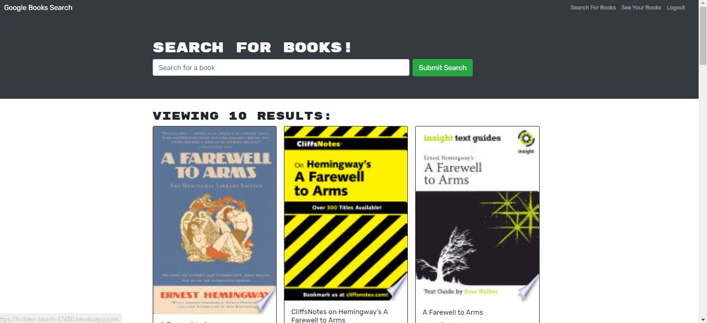

# Book-Search-Engine

Project Description
This week, we've take starter code with a fully functioning Google Books API search engine built with a RESTful API, and refactor it to be a GraphQL API built with Apollo Server. The app was built using the MERN stack with a React front end, MongoDB database, and Node.js/Express.js server and API. It's already set up to allow users to save book searches to the back end.

To complete the assignment, you’ll need to do the following:

- Set up an Apollo Server to use GraphQL queries and mutations to fetch and modify data, replacing the existing RESTful API.
- Modify the existing authentication middleware so that it works in the context of a GraphQL API.
- Create an Apollo Provider so that requests can communicate with an Apollo Server.
- Deploy your application to Heroku with a MongoDB database using MongoDB Atlas. Use the Deploy with Heroku and MongoDB Atlas walkthrough for instructions.

## User Stories
`
- AS AN avid reader
- I WANT to search for new books to read
- SO THAT I can keep a list of books to purchase`

## Acceptance Criteria
`
- GIVEN a book search engine
- WHEN I load the search engine
- THEN I am presented with a menu with the options Search for Books and Login/Signup and an input field to search for books and a submit button
- WHEN I click on the Search for Books menu option
- THEN I am presented with an input field to search for books and a submit button
- WHEN I am not logged in and enter a search term in the input field and click the submit button
- THEN I am presented with several search results, each featuring a book’s title, author, description, image, and a link to that book on the Google Books site
- WHEN I click on the Login/Signup menu option
- THEN a modal appears on the screen with a toggle between the option to log in or sign up
- WHEN the toggle is set to Signup
- THEN I am presented with three inputs for a username, an email address, and a password, and a signup button
- WHEN the toggle is set to Login
- THEN I am presented with two inputs for an email address and a password and login button
- WHEN I enter a valid email address and create a password and click on the signup button
- THEN my user account is created and I am logged in to the site
- WHEN I enter my account’s email address and password and click on the login button
- THEN I the modal closes and I am logged in to the site
- WHEN I am logged in to the site
- THEN the menu options change to Search for Books, an option to see my saved books, and Logout
- WHEN I am logged in and enter a search term in the input field and click the submit button
- THEN I am presented with several search results, each featuring a book’s title, author, description, image, and a link to that book on the Google Books site and a button to save a book to my account
- WHEN I click on the Save button on a book
- THEN that book’s information is saved to my account
- WHEN I click on the option to see my saved books
- THEN I am presented with all of the books I have saved to my account, each featuring the book’s title, author, description, image, and a link to that book on the Google Books site and a button to remove a book from my account
- WHEN I click on the Remove button on a book
- THEN that book is deleted from my saved books list
- WHEN I click on the Logout button
- THEN I am logged out of the site and presented with a menu with the options Search for Books and Login/Signup and an input field to search for books and a submit button  
`

## Our Application

### Link
`HEROKU`
https://hidden-beach-37480.herokuapp.com/

GITHUB
https://github.com/oscarcbryant/Book-Search-Engine

### Media
The Search function when logged in:

### Link

### Technologies used
`React
Javascript
CSS
Apollo
Graph QL
HTML
Heroku`

### Author
This project was written and submitted by:

Oscar Charles Bryant https://github.com/oscarcbryant

May 16th, 2022
